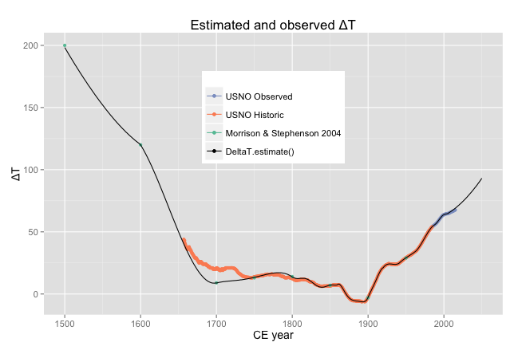

# solarpositioning

This is a Java library for finding topocentric solar coordinates, i.e. the sun’s position on the sky at a given date, latitude, and longitude (and other parameters). Calculations are based on well-known published algorithms: [SPA](http://dx.doi.org/10.1016/j.solener.2003.12.003) by Reda and Andreas and, alternatively, [Grena/ENEA](http://dx.doi.org/10.1016/j.solener.2012.01.024) by Grena or [PSA](http://dx.doi.org/10.1016/S0038-092X(00)00156-0") by Blanco-Muriel et al.

## Usage

### Maven coordinates

```xml
<dependency>
    <groupId>net.e175.klaus</groupId>
    <artifactId>solarpositioning</artifactId>
    <version>0.0.8</version> <!-- or whatever latest release is -->
</dependency>
```

Occasional snapshots are deployed to https://oss.sonatype.org/content/repositories/snapshots

### Code

```java
import net.e175.klaus.solarpositioning.*;

public class App {
  public static void main(String[] args) {
    final GregorianCalendar dateTime = new GregorianCalendar();

    AzimuthZenithAngle position = SPA.calculateSolarPosition(
                                            dateTime,
                                            48.21, // latitude (degrees)
                                            16.37, // longitude (degrees)
                                            190, // elevation (m)
                                            DeltaT.estimate(dateTime), // delta T (s)
                                            1010, // avg. air pressure (hPa)
                                            11); // avg. air temperature (°C)
    System.out.println("SPA: " + position);
  }
}
```

### Which algorithm should I use?

* For many applications, Grena3 should work just fine. It's fast and pretty accurate for a time window from 2010 to 2110 CE.
* If you're looking for maximum accuracy or need to calculate for historic dates, use SPA. It's widely considered the reference algorithm for solar positioning, being very accurate and usable in a very large time window. Its only downside is that it's relatively slow.
* PSA is another fast and simple algorithm, but should not be used for new applications due to its limited time window. It is currently kept for backwards compatibility.

### Is the code thread-safe?

Yes. None of the classes hold any mutable shared state. As the calculation is obviously CPU-bound, explicit multithreading does make sense whenever a lot of positions need to be calculated.

### How do I get the time of sunrise or sunset?

The SPA class now includes a method to calculate the times of sunrise, sun transit, and sunset in one fell swoop:

```java
GregorianCalendar[] res = SPA.calculateSunriseTransitSet(
                                    time, 
                                    70.978056, // latitude  
                                    25.974722, // longitude
                                    68); // delta T
```

Notes:
 
 * The times of sunrise and sunset may be null if the sun never sets or rises during the specified day (i.e. polar days and nights).
 * Calculation is based on the astronomical definition of sunrise and sunset, using a refraction correction of -0.8333°.
 * For various reasons, sunrise and sunset times may differ from those given by other sources. If you feel there's something wrong with the results of this library, please make sure to compare with a reputable source such as the [NOAA calculator](http://www.esrl.noaa.gov/gmd/grad/solcalc/) and not one of the many quick-and-dirty algorithms found on the Web.   

### What's with this "delta T" thing?

See [Wikipedia](https://en.wikipedia.org/wiki/ΔT) for an explanation. For many simple applications, this value could be negligible as it's just about a minute as of this writing. However, if you're looking for maximum accuracy, you should either use a current observed value (available from e.g. the US Naval Observatory) or at least a solid estimate.

The DeltaT class provides an estimator based on polynomials fitting a number of observed (or extrapolated) historical values, published by [Espenak and Meeus](http://eclipse.gsfc.nasa.gov/SEcat5/deltatpoly.html). Here's a plot of its output compared with some published ΔT data:



